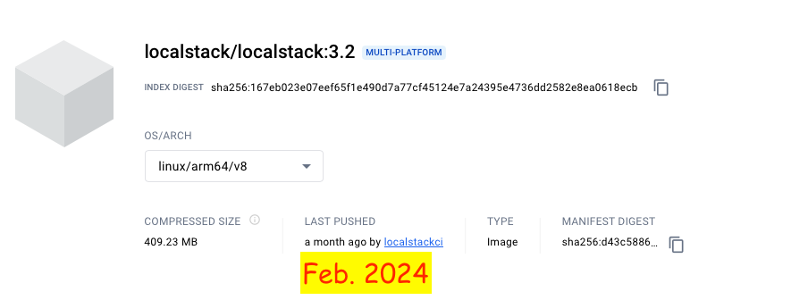
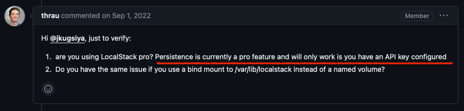
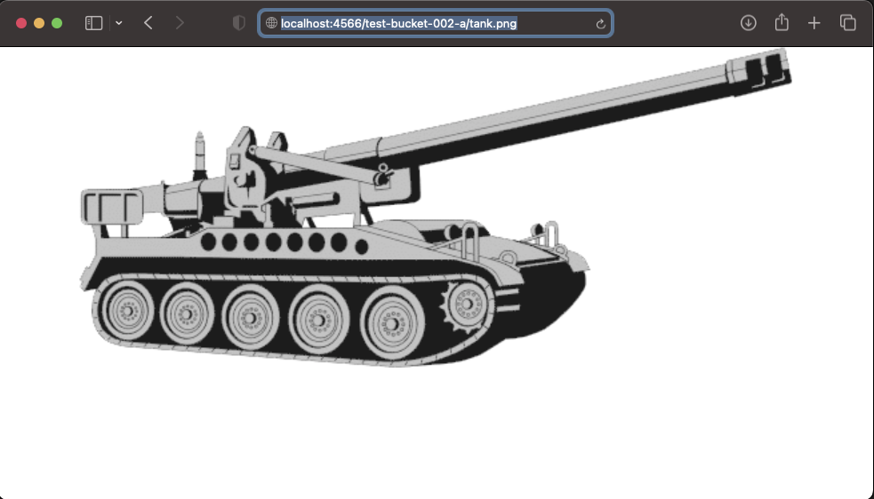

# Localstack 3.2

**Definisi localstack.**  
LocalStack adalah sebuah alat pengembangan perangkat lunak open-source yang menyediakan lingkungan simulasi awan lokal untuk pengembangan dan pengujian aplikasi cloud. Ini memungkinkan pengembang untuk membuat replika lingkungan cloud di mesin lokal mereka, memungkinkan pengembangan dan pengujian aplikasi tanpa perlu terhubung ke layanan cloud yang sebenarnya.

&nbsp;

    
    
URL : https://hub.docker.com/layers/localstack/localstack/3.2/images/sha256-e123bfa05e504ab5fd3eac4c2209f375aff0fbc9401184c4ea34d0b7b919a7af?context=explore

 

&nbsp;

---

ATTENTION ! 

Localstack `persistence` is currently a pro feature and will only work is you have an API key configured

    
    
URL : https://github.com/localstack/localstack/issues/6799

 

---

&nbsp;

### &#x1F530; Start Deployment in docker compose without persistence.

&nbsp;

<pre>
    ❯ ccat docker-compose.yml

            version: '3.7'
            
            services:
              localstack:
                image: localstack/localstack:3.2
                container_name: localstack_s3
                network_mode: bridge
                environment:
                  - DOCKER_HOST=unix:///var/run/docker.sock
                  - SERVICES=s3
                  - EDGE_PORT=4566
                  # - PERSISTENCE=1
                  # - LOCALSTACK_API_KEY=${LOCALSTACK_API_KEY-}                   # required for Pro
                  - DEBUG=0
                  # - LS_LOG=trace
                ports:
                  - "4566:4566"
                volumes:
                  - ./localstack/localstack_root:/var/lib/localstack              # the LocalStack volume directory root
                  - "/var/run/docker.sock:/var/run/docker.sock"
</pre>

&nbsp;

Build.
<pre>
    ❯ docker-compose up

        [+] Running 1/0
        ⠿ Container localstack_s3  Created                                                                                                                                                     0.0s
        Attaching to localstack_s3
        localstack_s3  | 
        localstack_s3  | LocalStack version: 3.2.0
        localstack_s3  | LocalStack Docker container id: e03dc7f188c5
        localstack_s3  | LocalStack build date: 2024-02-28
        localstack_s3  | LocalStack build git hash: 4a4692dd5
        localstack_s3  | 
        localstack_s3  | 2024-03-29T09:39:27.093  WARN --- [  MainThread] localstack.deprecations    : EDGE_PORT is deprecated (since 2.0.0) and will be removed in upcoming releases of LocalStack! This configuration will be migrated to GATEWAY_LISTEN
        localstack_s3  | 2024-03-29T09:39:27.192  INFO --- [-functhread4] hypercorn.error            : Running on https://0.0.0.0:4566 (CTRL + C to quit)
        localstack_s3  | 2024-03-29T09:39:27.192  INFO --- [-functhread4] hypercorn.error            : Running on https://0.0.0.0:4566 (CTRL + C to quit)
        localstack_s3  | Ready.
</pre>

&nbsp;

File structure of the mounting directory.
<pre>
    ❯ tree -L 5 -a  ./localstack
        └── localstack_root
            ├── cache
            │   ├── machine.json
            │   ├── server.test.pem
            │   ├── server.test.pem.crt
            │   ├── server.test.pem.key
            │   └── service-catalog-3_2_0-1_34_49.pickle
            ├── lib
            ├── logs
            └── tmp
</pre>

&nbsp;

&nbsp;

Reference : 
- https://docs.aws.amazon.com/cli/latest/reference/s3api/ 
- https://docs.aws.amazon.com/cli/latest/reference/s3api/create-bucket.html
- https://docs.outscale.com/en/userguide/Creating-a-Bucket.html

&nbsp;

### &#x1F530; Testing with experimental stages.

**&#x1F525;[ Managing Buckets - creating bucket. ]**

- &#x2705; Command into the container.

        ❯ docker exec -it localstack_s3 /bin/bash

    Example 1: To create a bucket
    <pre>
        ❯ awslocal s3api create-bucket --bucket test-bucket-001-a --region us-east-1
            {
                "Location": "/test-bucket-001-a"
            }        
    </pre>
    <pre>
        ❯ AWS_DEFAULT_REGION=us-east-1 awslocal s3api create-bucket --bucket test-bucket-002-a
            {
                "Location": "/test-bucket-002-a"
            }        
    </pre>

    &nbsp;

    Example 2: To create a bucket with owner enforced
    <pre>
        ❯ awslocal s3api create-bucket --bucket test-bucket-003-a --region us-east-1 --object-ownership BucketOwnerEnforced
            {
                "Location": "/test-bucket-003-a"
            }        
    </pre>

    &nbsp;

    Example 3: To create a bucket outside of the `us-east-1` region
    <pre>
        ❯ awslocal s3api create-bucket --bucket test-bucket-004-a --region us-west-1 --create-bucket-configuration LocationConstraint=us-west-1
            {
                "Location": "http://test-bucket-004-a.s3.localhost.localstack.cloud:4566/"
            }

        ❯ awslocal s3api create-bucket --bucket test-bucket-005-a --region us-west-2 --create-bucket-configuration LocationConstraint=us-west-2
            {
                "Location": "http://test-bucket-005-a.s3.localhost.localstack.cloud:4566/"
            }        
    </pre>

    &nbsp;

- &#x2705; Command used outside the container.

    <pre>
        ❯ exit
    </pre>

    Example 1: To create a bucket
    <pre>
    ❯ aws s3api create-bucket --bucket test-bucket-001-b --region us-east-1 --endpoint http://localhost:4566
        {
            "Location": "/test-bucket-001-b"
        }    

    ❯ AWS_DEFAULT_REGION=us-east-1 aws s3api create-bucket --bucket test-bucket-002-b --endpoint http://localhost:4566
        {
            "Location": "/test-bucket-002-b"
        }    
    </pre>
    
    &nbsp;

    Example 2: To create a bucket with owner enforced
    <pre>
    ❯ aws s3api create-bucket --bucket test-bucket-003-b --region us-east-1 --object-ownership BucketOwnerEnforced --endpoint http://localhost:4566
        {
        "Location": "/test-bucket-003-b"
        }
    </pre>

    &nbsp;

    Example 3: To create a bucket outside of the `us-east-1` region
    <pre>
    ❯ aws s3api create-bucket --bucket test-bucket-004-b --region us-west-1 \
        --create-bucket-configuration LocationConstraint=us-west-1 \
        --endpoint http://localhost:4566
        {
            "Location": "http://test-bucket-004-b.s3.localhost.localstack.cloud:4566/"
        }        

    ❯ aws s3api create-bucket --bucket test-bucket-005-b --region us-west-2 \
        --create-bucket-configuration LocationConstraint=us-west-2 \
        --endpoint http://localhost:4566
        {
            "Location": "http://test-bucket-005-b.s3.localhost.localstack.cloud:4566/"
        }        
    </pre>

&nbsp;

&nbsp;

**&#x1F525;[ Managing Buckets - listing bucket. ]**

- &#x2705; Command into the container.

        ❯ docker exec -it localstack_s3 /bin/bash

    <pre>
        ❯ awslocal s3api list-buckets
                {
                    "Buckets": [
                        {
                            "Name": "test-bucket-001-a",
                            "CreationDate": "2024-03-29T10:11:43.000Z"
                        },
                        {
                            "Name": "test-bucket-002-a",
                            "CreationDate": "2024-03-29T10:12:23.000Z"
                        },
                        {
                            "Name": "test-bucket-003-a",
                            "CreationDate": "2024-03-29T10:14:32.000Z"
                        },
                        {
                            "Name": "test-bucket-004-a",
                            "CreationDate": "2024-03-29T10:15:07.000Z"
                        },
                        {
                            "Name": "test-bucket-005-a",
                            "CreationDate": "2024-03-29T10:15:43.000Z"
                        },
                        {
                            "Name": "test-bucket-001-b",
                            "CreationDate": "2024-03-29T10:20:00.000Z"
                        },
                        {
                            "Name": "test-bucket-002-b",
                            "CreationDate": "2024-03-29T10:23:10.000Z"
                        },
                        {
                            "Name": "test-bucket-003-b",
                            "CreationDate": "2024-03-29T10:29:11.000Z"
                        },
                        {
                            "Name": "test-bucket-004-b",
                            "CreationDate": "2024-03-29T10:31:21.000Z"
                        },
                        {
                            "Name": "test-bucket-005-b",
                            "CreationDate": "2024-03-29T10:31:40.000Z"
                        }
                    ],
                    "Owner": {
                        "DisplayName": "webfile",
                        "ID": "75aa57f09aa0c8caeab4f8c24e99d10f8e7faeebf76c078efc7c6caea54ba06a"
                    }
                }            
    </pre>

- &#x2705; Command used outside the container.

    <pre>
        ❯ exit
    </pre>
    <pre>
    ❯ aws s3api list-buckets --endpoint http://localhost:4566
        {
            "Buckets": [
                {
                    "Name": "test-bucket-001-a",
                    "CreationDate": "2024-03-29T10:11:43+00:00"
                },
                {
                    "Name": "test-bucket-002-a",
                    "CreationDate": "2024-03-29T10:12:23+00:00"
                },
                {
                    "Name": "test-bucket-003-a",
                    "CreationDate": "2024-03-29T10:14:32+00:00"
                },
                {
                    "Name": "test-bucket-004-a",
                    "CreationDate": "2024-03-29T10:15:07+00:00"
                },
                {
                    "Name": "test-bucket-005-a",
                    "CreationDate": "2024-03-29T10:15:43+00:00"
                },
                {
                    "Name": "test-bucket-001-b",
                    "CreationDate": "2024-03-29T10:20:00+00:00"
                },
                {
                    "Name": "test-bucket-002-b",
                    "CreationDate": "2024-03-29T10:23:10+00:00"
                },
                {
                    "Name": "test-bucket-003-b",
                    "CreationDate": "2024-03-29T10:29:11+00:00"
                },
                {
                    "Name": "test-bucket-004-b",
                    "CreationDate": "2024-03-29T10:31:21+00:00"
                },
                {
                    "Name": "test-bucket-005-b",
                    "CreationDate": "2024-03-29T10:31:40+00:00"
                }
            ],
            "Owner": {
                "DisplayName": "webfile",
                "ID": "75aa57f09aa0c8caeab4f8c24e99d10f8e7faeebf76c078efc7c6caea54ba06a"
            }
        }    
    </pre>

&nbsp;

&nbsp;

**&#x1F525;[ Managing Buckets - deleting bucket. ]**

- &#x2705; Command into the container.

        ❯ docker exec -it localstack_s3 /bin/bash

    <pre>
        ❯ awslocal s3api delete-bucket --bucket test-bucket-005-a --region us-east-1
    </pre>

- &#x2705; Command used outside the container.

    <pre>
        ❯ exit
    </pre>
    <pre>
        ❯ aws s3api delete-bucket --bucket test-bucket-005-b --region us-east-1 --endpoint http://localhost:4566
    </pre>

&nbsp;

&nbsp;

**&#x1F525;[ Working with objects - uploading an object to a bucket. ]**

- &#x2705; Command used outside the container.

    <pre>
        ❯ exit
    </pre>
    <pre>
    ❯ aws s3api put-object --bucket test-bucket-001-a --key tank.png --body ./tank.png --endpoint http://localhost:4566
        {
            "ETag": "\"ecdcc986fca929f13c8d36cf804d1e1c\"",
            "ServerSideEncryption": "AES256"
        }
    </pre>
    <pre>
    ❯ aws --endpoint-url=http://localhost:4566 s3 cp ./tank.png s3://test-bucket-002-a/tank.png
        upload: ./tank.png to s3://test-bucket-002-a/tank.png
    </pre>

- &#x2705; Command into the container.

        ❯ docker exec -it localstack_s3 /bin/bash

    Copying an Object to a Bucket Using AWS CLI (s3api).
    <pre>
            ❯ awslocal s3api copy-object --bucket test-bucket-003-a --key tank.png \
                --copy-source test-bucket-002-a/tank.png \
                --content-type image/png \
                --metadata-directive "COPY"
                    {
                        "ServerSideEncryption": "AES256",
                        "CopyObjectResult": {
                            "ETag": "\"ecdcc986fca929f13c8d36cf804d1e1c\"",
                            "LastModified": "2024-03-29T11:49:43.000Z"
                        }
                    }                
    </pre>

&nbsp;

&nbsp;

**&#x1F525;[ Working with objects - listing the object of a bucket. ]**

- &#x2705; Command into the container.

        ❯ docker exec -it localstack_s3 /bin/bash

    <pre>
        ❯ awslocal s3api list-objects --bucket test-bucket-001-a
            {
                "Contents": [
                    {
                        "Key": "tank.png",
                        "LastModified": "2024-03-29T11:36:47.000Z",
                        "ETag": "\"ecdcc986fca929f13c8d36cf804d1e1c\"",
                        "Size": 25600,
                        "StorageClass": "STANDARD",
                        "Owner": {
                            "DisplayName": "webfile",
                            "ID": "75aa57f09aa0c8caeab4f8c24e99d10f8e7faeebf76c078efc7c6caea54ba06a"
                        }
                    }
                ],
                "RequestCharged": null
            }

        ❯ awslocal s3api list-objects --bucket test-bucket-003-a
            {
                "Contents": [
                    {
                        "Key": "tank.png",
                        "LastModified": "2024-03-29T11:49:43.000Z",
                        "ETag": "\"ecdcc986fca929f13c8d36cf804d1e1c\"",
                        "Size": 25600,
                        "StorageClass": "STANDARD",
                        "Owner": {
                            "DisplayName": "webfile",
                            "ID": "75aa57f09aa0c8caeab4f8c24e99d10f8e7faeebf76c078efc7c6caea54ba06a"
                        }
                    }
                ],
                "RequestCharged": null
            }        
    </pre>
- &#x2705; Command used outside the container.
    <pre>
        ❯ exit
    </pre>
    <pre>
    ❯ aws s3api list-objects --bucket test-bucket-002-a --endpoint http://localhost:4566
        {
            "Contents": [
                {
                    "Key": "tank.png",
                    "LastModified": "2024-03-29T11:47:07+00:00",
                    "ETag": "\"ecdcc986fca929f13c8d36cf804d1e1c\"",
                    "Size": 25600,
                    "StorageClass": "STANDARD",
                    "Owner": {
                        "DisplayName": "webfile",
                        "ID": "75aa57f09aa0c8caeab4f8c24e99d10f8e7faeebf76c078efc7c6caea54ba06a"
                    }
                }
            ]
        }    
    </pre>

localstack amazon S3 Access image by url

    
    
image by url

 

&nbsp;

&nbsp;

**&#x1F525;[ Working with objects - downloading an object from a bucket. ]**

- &#x2705; Command used outside the container.
    <pre>
        ❯ exit
    </pre>
    <pre>
    ❯ aws s3api get-object --bucket test-bucket-002-a --key tank.png \
       ~/Documents/test/from-github-all/terraform-in-docker-compose-and-docker-run-container-localstack/localstack-3.2-service-s3-docker-compose/tank.png \
       --endpoint http://localhost:4566
            {
                "AcceptRanges": "bytes",
                "LastModified": "2024-03-29T11:47:07+00:00",
                "ContentLength": 25600,
                "ETag": "\"ecdcc986fca929f13c8d36cf804d1e1c\"",
                "ContentType": "image/png",
                "ServerSideEncryption": "AES256",
                "Metadata": {}
            }       

    ❯ aws s3api get-object --bucket test-bucket-002-a --key tank.png \
       ./tank.png --endpoint http://localhost:4566
            {
                "AcceptRanges": "bytes",
                "LastModified": "2024-03-29T11:47:07+00:00",
                "ContentLength": 25600,
                "ETag": "\"ecdcc986fca929f13c8d36cf804d1e1c\"",
                "ContentType": "image/png",
                "ServerSideEncryption": "AES256",
                "Metadata": {}
            }                  
    </pre>

&nbsp;

&nbsp;

**&#x1F525;[ Working with objects - Removing objects from a bucket. ]**

- &#x2705; Command into the container.

        ❯ docker exec -it localstack_s3 /bin/bash

    <pre>
        ❯ awslocal s3api delete-object --bucket test-bucket-002-a --key tank.png

        ❯ awslocal s3api list-objects --bucket test-bucket-002-a
            {
                "RequestCharged": null
            }        
    </pre>

- &#x2705; Command used outside the container.
    <pre>
        ❯ exit
    </pre>
    <pre>
    ❯ aws s3api delete-object --bucket test-bucket-001-a --key tank.png --endpoint http://localhost:4566
    </pre>

&nbsp;

&nbsp;

&nbsp;

&nbsp;

---

&nbsp;

    

 

&nbsp;

---

&nbsp;

&nbsp;
